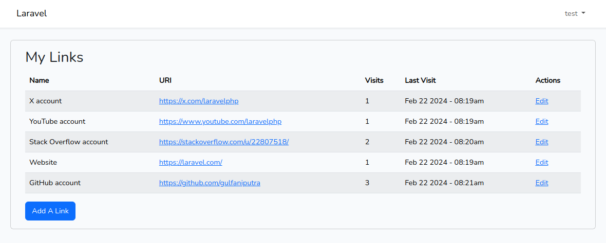
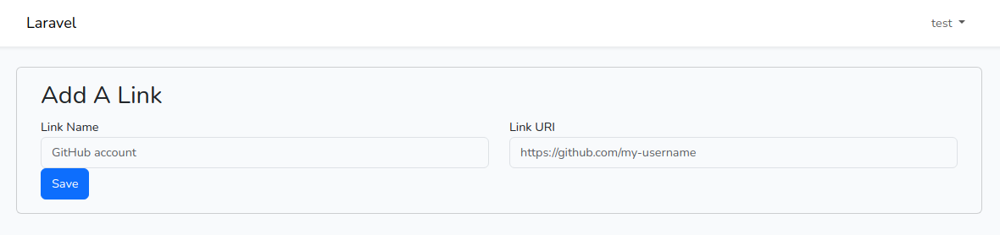
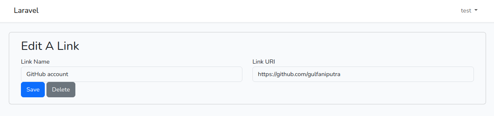

# Linkx App

_**Note:** this project is a work in progress_

A spartan web application for social media reference landing pages inspired by sites such as Linktree, Biolinky, and Campsite.

The name 'Linkx' derives from the wildcat genus _Lynx_.

## Table Of Contents

-   [Introduction](#introduction)
-   [ERD](#erd)
-   [Local Server Installation](#local-server-installation)
-   [Features](#features)
-   [Stack](#stack)

## Introduction

The objective is to learn and apply basic web development concepts such as MVC and database.

## ERD


## Local Server Installation

-   Clone the repo:

    ```
    $ git clone https://github.com/gulfaniputra/linkx-app.git
    ```

-   Move to the `linkx-app` directory on your local machine:

    ```
    $ cd linkx-app
    ```

-   Copy `.env.example` and rename it as `.env`.

-   Configure the database section in `.env`:

    ```
    ...

    DB_CONNECTION=<my_connection>
    DB_HOST=<my_host>
    DB_PORT=<my_port>
    DB_DATABASE=<my_database>
    DB_USERNAME=<my_username>
    DB_PASSWORD=<my_password>

    ...
    ```

-   Install the app’s dependencies:

    ```
    $ composer install
    $ npm install
    ```

-   Generate the `APP_KEY` in `.env` to a random string:

    ```
    $ php artisan key:generate
    ```

-   Create the migration repository:

    ```
    $ php artisan migrate
    ```

-   Seed the database:

    ```
    $ php artisan db:seed
    ```

-   Start Laravel's local development server:

    ```
    $ php artisan serve
    ```

## Features

-   Links page:

    

-   Links dashboard:

    

-   'Add A Link':

    

-   'Edit A Link':

    

-   'Edit Settings':

    

## Stack

-   Laravel 10
-   jQuery 3
-   Ajax
-   Bootstrap 5
